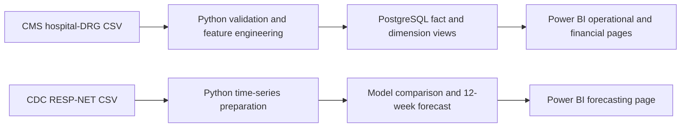

# Healthcare Operations Intelligence Platform

An end-to-end healthcare analytics portfolio project that combines hospital
operations, financial performance, and short-term demand forecasting in a
four-page Power BI report.

The project uses Python for data validation, feature engineering, exploratory
analysis, and forecasting; PostgreSQL for the analytical data model; and Power
BI for executive reporting.

## Project website

The responsive portfolio site is stored in [`docs/`](docs/) and is designed for
direct deployment through GitHub Pages from the `main` branch and `/docs`
publishing folder. It presents the project story, headline results, dashboard
pages, data pipeline, star schema, and model comparison without requiring a
Power BI installation.

## Business objective

The analysis answers four practical questions:

1. Where are Medicare inpatient volume and financial activity concentrated?
2. Which hospitals, DRGs, states, and rural/urban segments have the largest
   charge-to-payment gaps?
3. How does each hospital's submitted-charge profile compare with its state
   benchmark?
4. What does the next 12 weeks of the COVID-NET hospitalization-rate signal
   look like, and how uncertain is that forecast?

## Architecture



The CMS and CDC datasets remain separate. The forecast is a complementary
public-health demand indicator and is not joined row-by-row to hospital or DRG
financial records.

## Headline results

| Metric | Result |
|---|---:|
| Hospital-DRG records | 145,879 |
| Hospitals | 2,906 |
| DRGs | 540 |
| States and territories | 51 |
| Total inpatient discharges | 4,952,481 |
| Estimated submitted charges | $457.65B |
| Estimated total payments | $90.93B |
| Estimated Medicare payments | $75.11B |
| Weighted average submitted charge | $92,407.85 |
| Weighted average total payment | $18,359.99 |
| Aggregate total-payment coverage | 19.87% |
| Aggregate Medicare coverage | 16.41% |

Estimated totals are calculated as the source average amount multiplied by
discharges. They are analytical estimates, not hospital revenue or audited
claim totals.

## Forecasting result

Six candidate models were evaluated on the most recent 52 observed weeks using
a chronological holdout. The selected model was `AutoReg Recent 156 Weeks`.

| Validation metric | Result |
|---|---:|
| MAE | 0.276 |
| RMSE | 0.350 |
| MAPE | 38.8% |
| Forecast horizon | 12 weeks |

The forecast increases from approximately 0.20 hospitalizations per 100,000 to
a peak near 0.43, then declines to approximately 0.22. Its approximate 95%
interval ranges from 0 to about 1.02 per 100,000. Because percentage errors are
unstable when observed rates are close to zero, the forecast is intended for
directional planning rather than exact capacity commitments.

## Power BI report

The completed report is available at
[dashboard/healthcare_operations_intelligence.pbix](dashboard/healthcare_operations_intelligence.pbix).

It contains four pages:

- **Executive Overview** — headline KPIs, state map, and leading hospitals and
  DRGs by inpatient discharges.
- **Financial Performance** — charges, payments, coverage, high-volume
  charge-to-payment review, and hospital volume/charge profiling.
- **Operational Performance** — rural/urban comparison, state benchmarks,
  leading hospitals, and leading DRGs.
- **Forecasting** — selected model, validation metrics, recent actuals,
  12-week forecast, uncertainty bounds, model comparison, and weekly details.

The PostgreSQL semantic model uses a star schema:

```text
Dim_Hospital (1) ─── (*) Fact_Hospital_DRG (*) ─── (1) Dim_DRG
```

Both relationships are active and filter in a single direction from dimension
to fact.

## Data sources

- [CMS Medicare Inpatient Hospitals - by Provider and Service](https://data.cms.gov/provider-summary-by-type-of-service/medicare-inpatient-hospitals/medicare-inpatient-hospitals-by-provider-and-service)
  supplies hospital, MS-DRG, discharge, submitted-charge, and payment data.
- [CDC RESP-NET Rates and Clinical Data](https://data.cdc.gov/Public-Health-Surveillance/RESP-NET-Rates-and-Clinical-Data/kvib-3txy)
  supplies the overall observed weekly COVID-NET hospitalization rate per
  100,000 used for forecasting.

Raw source files are intentionally excluded from version control. Download the
official files and save them as:

```text
data/raw/medicare_inpatient_hospitals.CSV
data/raw/resp_net_hospitalization_rates.csv
```

## Engineered analytical features

The cleaning pipeline validates identifiers, required fields, numeric values,
missingness, duplicates, negative amounts, and zero denominators. It then
creates eight approved features:

- Payment gap
- Medicare payment gap
- Total payment coverage percentage
- Medicare coverage percentage
- Estimated submitted charges
- Estimated total payments
- Estimated Medicare payments
- Charge-to-total-payment ratio

## Repository structure

```text
healthcare-operations-analytics/
├── dashboard/              # Power BI report, DAX reference, build guide
├── data/
│   ├── raw/                # Downloaded source data; ignored by Git
│   └── processed/          # Generated datasets and outputs; ignored by Git
├── notebooks/              # Data understanding, EDA, and forecasting notebooks
├── reports/                # Reserved for exported report artifacts
├── sql/                    # Schema, import, analysis queries, and BI views
├── src/                    # Cleaning, EDA, and forecasting pipelines
├── requirements.txt
└── README.md
```

## Reproduce the project

### 1. Create the Python environment

From PowerShell in the project root:

```powershell
python -m venv venv
.\venv\Scripts\Activate.ps1
python -m pip install -r requirements.txt
```

### 2. Run the Python pipelines

After placing both source files in `data/raw`:

```powershell
python src\data_cleaning.py
python src\eda_analysis.py
python src\forecasting.py
```

Generated analytical outputs are written to `data/processed` and
`data/processed/analysis_outputs`.

### 3. Build the PostgreSQL model

Create the database, schema, data, and Power BI views:

```powershell
& "C:\Program Files\PostgreSQL\17\bin\psql.exe" -U postgres -W -d postgres -c "CREATE DATABASE healthcare_operations;"
& "C:\Program Files\PostgreSQL\17\bin\psql.exe" -U postgres -W -d healthcare_operations -f "sql\schema.sql"
& "C:\Program Files\PostgreSQL\17\bin\psql.exe" -U postgres -W -d healthcare_operations -f "sql\data_import.sql"
& "C:\Program Files\PostgreSQL\17\bin\psql.exe" -U postgres -W -d healthcare_operations -f "sql\power_bi_views.sql"
```

The expected database validation is 145,879 fact rows, 2,906 hospitals, 540
DRGs, and 4,952,481 discharges.

### 4. Open Power BI

Open the `.pbix` file in `dashboard`. The first three pages use the PostgreSQL
views. The Forecasting page uses the generated forecast CSVs. See
[dashboard/Power_BI_build_guide.md](dashboard/Power_BI_build_guide.md) and
[dashboard/DAX_measures.md](dashboard/DAX_measures.md) for the model and measure
definitions.

## Tools used

- Python: pandas, NumPy, statsmodels, scikit-learn, Jupyter
- PostgreSQL 17 and SQL
- Power BI Desktop and DAX
- Git/GitHub-ready repository structure

## Analytical limitations

- The CMS source describes Original Medicare fee-for-service inpatient activity
  and does not represent every patient or all hospital revenue.
- Suppressed low-volume records in the public source are not reconstructed.
- Multiplying average amounts by discharges produces estimates for comparison,
  not audited financial statements.
- RESP-NET is a surveillance signal with its own geographic coverage and should
  not be interpreted as a hospital-specific census forecast.
- Forecast intervals are approximate and become especially important while
  rates remain near zero.
